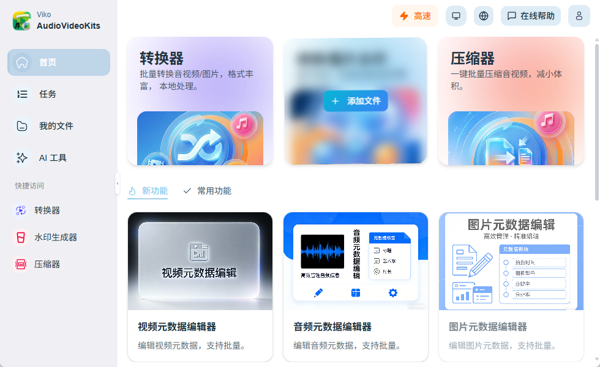
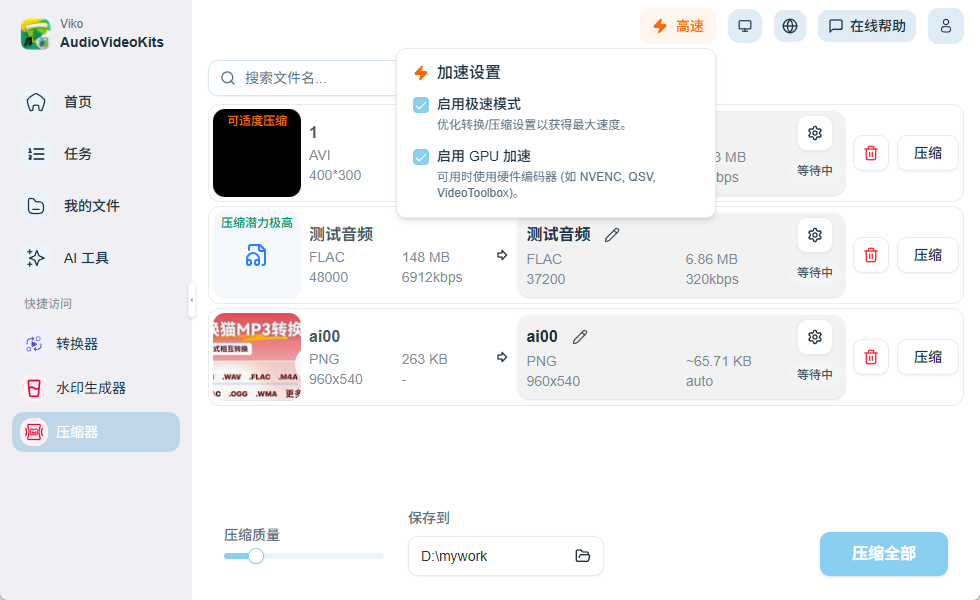
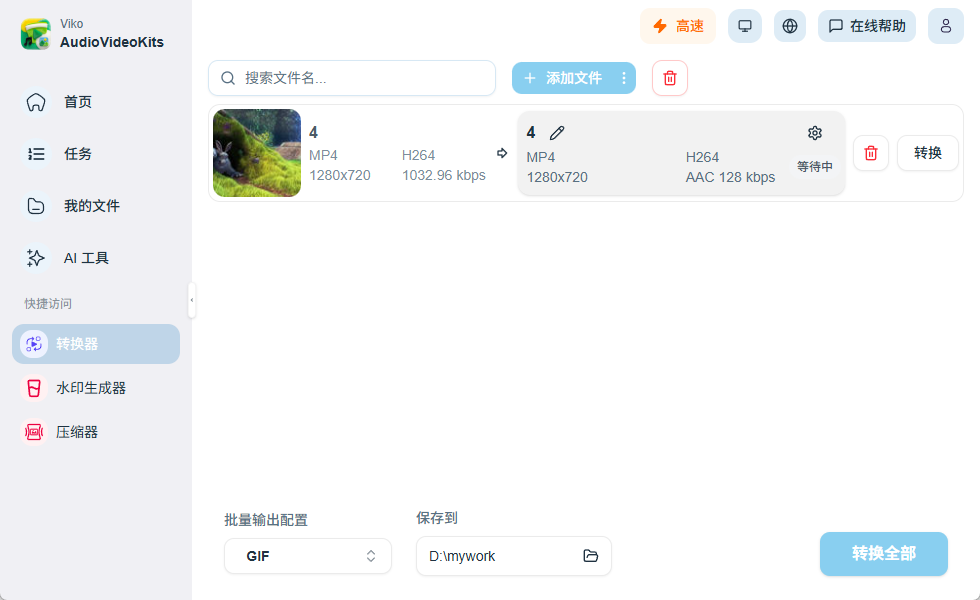
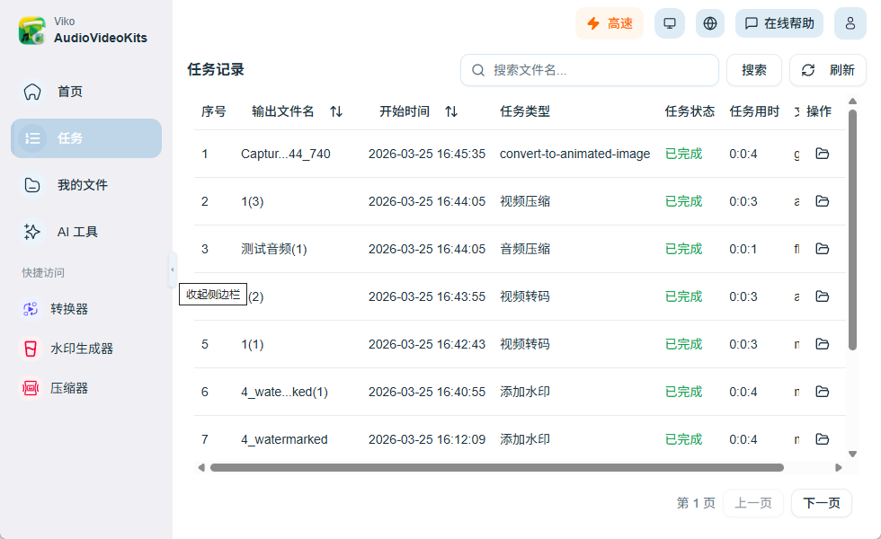

<div align="center">

# 🎬 Viko

**本地音视频图片处理工具 —— 转码、压缩、水印，文件不出本机**

_Viko · AudioVideoKits · 基于 FFmpeg 的桌面媒体工具箱_

[](../../releases)
[](LICENSE)
[](#)
[](#)
[](../../pulls)

**[English](docs/en.md) | 简体中文**

[](https://github.com/boy-lin/viko)

</div>

---

一款本地运行的媒体处理桌面应用，聚焦 **音频、视频、图片** 的转换、压缩与水印, 优化批量处理交互。

> ✅ 本地处理 · ✅ 批量任务队列 · ✅ 默认参数开箱即用 · ✅ 专业参数可精调 · ✅ 开源可二次开发

下载安装：[https://avi.2342342.xyz](https://avi.2342342.xyz)

---

## 📸 界面预览

<br/>

<table>
  <tr>
   <td align="center"><br/><sub>首页</sub></td>
    <td align="center"><br/><sub>压缩器</sub></td>
  </tr>
  <tr>
   <td align="center"><br/><sub>转换器</sub></td>
   <td align="center"><br/><sub>任务记录</sub></td>
  </tr>
</table>

---

## ✨ 核心功能

### 🔄 媒体处理

|    模块    | 能力          | 说明                                                |
| :--------: | ------------- | --------------------------------------------------- |
| **转换器** | 格式转码      | 批量转换音视频/图片，支持 GIF 等动图输出            |
| **压缩器** | 体积压缩      | 一键批量压缩，可调质量；支持极速模式与 GPU 硬件加速 |
|  **水印**  | 文本/图片水印 | 便于品牌与版权标注                                  |
|  **降噪**  | 音视频降噪    | 本地处理，适合日常素材优化                          |
| **元数据** | 元数据编辑    | 视频/音频/图片元数据批量编辑                        |

### ⚡ 任务与效率

- **批量队列**：多文件一次添加，统一配置或逐条微调
- **任务记录**：进度可视化，历史任务可搜索、排序、打开输出目录
- **我的文件**：处理结果集中管理
- **高速模式**：可选极速策略与 GPU 编码（NVENC / QSV / VideoToolbox 等，视系统环境而定）

### 🛡 本地优先

- 文件**不必上传云端**，隐私与素材安全更可控
- 媒体处理主链路基于 Rust **`ffmpeg-next`** 集成，稳定可控
- 针对常见格式做了兼容与参数兜底策略

---

## 🚀 快速开始

### 方式一：下载安装包（推荐普通用户）

前往 **[Releases](https://avi.2342342.xyz)** 下载对应平台的最新版安装包，安装后打开即可使用。

| 平台        | 说明                                              |
| ----------- | ------------------------------------------------- |
| **macOS**   | 支持 Apple Silicon（以 Release 提供的架构包为准） |
| **Windows** | NSIS 安装包                                       |

> 首次使用可直接采用默认参数出结果；需要时再逐步调整码率、分辨率、编码器等进阶选项。

### 方式二：从源码开发运行

> 需要 **Node.js 20+**、**Rust 稳定版**、**pnpm 10.11.1**

```bash
# 1. 克隆项目
git clone https://github.com/boy-lin/viko.git
cd viko

# 2. 安装依赖
corepack enable
pnpm install

# 3. 检查 FFmpeg 开发库（macOS / Linux）
pnpm check:deps

# 4. 启动桌面开发模式
pnpm tauri:dev
```

**Windows** 下 FFmpeg 依赖检查：

```powershell
pnpm check:deps:win
```

📖 更详细的打包说明请见 → **[BUILD.md](BUILD.md)**

### 本地打包

```bash
# 打包当前平台
pnpm tauri:build

# 指定平台
pnpm build:mac:arm      # macOS Apple Silicon
pnpm build:mac:intel    # macOS Intel
pnpm build:win          # Windows
pnpm build:linux        # Linux
```

> 若启用应用内更新签名，打包前需配置 `TAURI_SIGNING_PRIVATE_KEY` 环境变量（CI 已配置，本地 Release 可参考 `.env.example`）。

---

## 🏗 项目架构

```
Viko/
├── src/                   # React + TypeScript 前端
│   ├── pages/             # 转换器、压缩器、水印、任务记录等页面
│   ├── components/        # UI 与业务组件
│   ├── lib/               # Tauri Bridge、任务队列等
│   └── stores/            # Zustand 状态
├── src-tauri/             # Rust + Tauri 2 桌面端
│   ├── src/services/      # 转码、压缩、水印、GIF 等媒体服务
│   ├── src/task/          # 任务队列
│   └── src/media_common/  # FFmpeg 公共能力
├── public/                # 静态资源、截图、国际化
├── scripts/               # 依赖检查、打包、Release 脚本
└── docs/                  # 文档
```

**技术栈：**

| 层       | 技术                                                                     |
| -------- | ------------------------------------------------------------------------ |
| 前端     | React 18 + TypeScript + Vite + Tailwind CSS + Zustand + Radix UI         |
| 桌面     | Tauri 2                                                                  |
| 媒体引擎 | Rust `ffmpeg-next` 8.x（codec / format / filter / scaling / resampling） |
| 任务表格 | TanStack Table                                                           |

---

## ❓ 常见问题

**适合谁用？**  
短视频创作者、剪辑师、运营同学，以及有批量媒体处理需求的个人与小团队。

**不懂编码参数能用吗？**  
可以。默认参数可直接出结果，后续可按需要微调码率、分辨率、CRF/VBR 等。

**支持哪些格式？**  
覆盖主流音频、视频、图片格式；具体能力会受系统编解码环境影响。

**为什么压缩后体积变化不明显？**  
体积受源素材复杂度、码率、分辨率、编码策略共同影响；可进一步降低码率或调整分辨率。更多概念见 [docs/help.md](docs/help.md)。

**和在线工具比有什么优势？**  
本地处理，文件更可控；批量任务与参数调节更灵活，无需反复上传下载。

---

## 🎯 适合谁

| 用户类型        | 场景                           |
| --------------- | ------------------------------ |
| 📹 内容创作者   | 批量转码、压缩、加水印         |
| 🔒 隐私敏感用户 | 素材不上传云端，数据留在本机   |
| 🛠 开发者       | 基于 Tauri + FFmpeg 二次扩展   |
| 🌱 入门用户     | 默认参数即用，逐步学习进阶选项 |

---

## 🤝 参与贡献

欢迎任何形式的贡献！

- 🐛 **报告 Bug** → [新建 Issue](../../issues/new)
- 💡 **功能建议** → [新建 Issue](../../issues/new)
- 🔧 **提交代码** → Fork → 修改 → Pull Request
- ⭐ **给项目 Star** → 帮助更多人发现这个工具

开发约定见 [AGENTS.md](AGENTS.md)。

---

## 💬 联系 & 社区

独立开发的本地媒体工具，欢迎试用、反馈与共建。

- **作者微信**：`helloboyling`
- **用户交流群**：扫码加入，交流使用问题与功能建议

<table>
  <tr>
    <td align="center">
      <br/>
    </td>
  </tr>
</table>

> 群二维码有效期约 7 天，过期请加作者微信 `helloboyling` 拉群。

---

## 📄 License

[MIT](LICENSE)

---

<div align="center">

**如果这个项目对你有帮助，请点一下 ⭐ Star——这是对作者最大的鼓励！**

</div>
